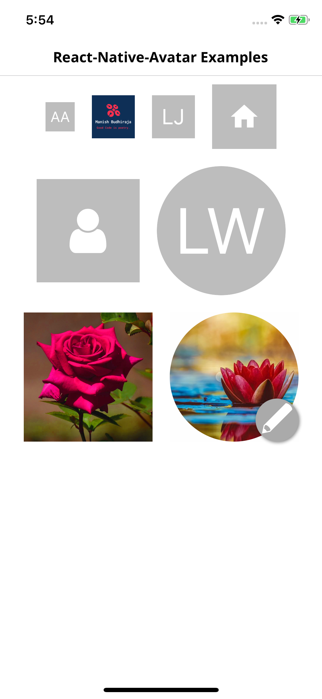

#  React-Native Avatar

React Native Avatars can be used to represent people in a graphical way with support for falling back to using the user's initials on a colored background as the avatar if valid source is not present.




###  Installation
----
```
npm install --save react-native-avatar
npm install --save react-native-vector-icons
react-native link react-native-vector-icons
```

###  Props

| Prop | Type | Default | Description |
|--|--|--|--|
| activeOpacity | number  | 0.2  | opacity when pressed |
| avatarStyle | object (style) | none  | Avatar image style |
| containerStyle | object (style)	  | none  | Outer container style |
| editButton | { name: 'mode-edit', type: 'material', color: '#fff', underlayColor: '#000' }  | none  | Vector Icon props to be user for edit button |
| icon | object {name: string, color: string, size: number, type: string }  | (default is Material, or [choose from supported icon sets](https://github.com/imbudhiraja/react-native-avatar#icon-set) | Displays an icon as the main content of the Avatar. Cannot be used alongside title. When used with the source prop it will be used as the placeholder. |
| iconStyle | object (style) | none  | styling for icon component |
| imageProps | object  | none  | Optional properties to pass to the avatar e.g "resizeMode" |
| onEditPress | function  | none  | Callback function when pressing on the edit button |
| onLongPress | function  | none  | Callback function when long pressing component |
| onPress | function  | none  | Callback function when pressing the component |
| overlayContainerStyle | object (style) | none  | Style for the view outside image or icon |
| placeholderStyle | object (style)  | { backgroundColor: '#BDBDBD' }  | Adds style to the placeholder wrapper |
| rounded | boolean  | false  | Makes the avatar circular |
| size | string or number  | Sizes.SMALL | Size of the avatar, [choose from supported size sets](https://github.com/imbudhiraja/react-native-avatar#avatar-size-set)  or give any number |
| showEditButton | boolean  | false  | Shows an edit button over the avatar  |
| source | object (style)  | none  | [Image source](https://facebook.github.io/react-native/docs/image#source)  |
| title | string  | none  | To render initials of title inside placeholder  |
| titleStyle | object (style)  | none  | Style for the title |
| renderPlaceholderContent | function  | default title  | Custom placeholder element in place of title |
| Component | function  | [TouchableHighlight](https://facebook.github.io/react-native/docs/touchablehighlight)  | Component for enclosing element |
| ImageComponent | React component or element  | [Image](https://facebook.github.io/react-native/docs/image)  | Custom ImageComponent for Avatar |

### Avatar Size Set
import { Sizes } from 'react-native-avatar';

| Size |  Description |
|--|--|
| Sizes.EXTRA_SMALL |  extra small size avatar |
| Sizes.SMALL |  return small size avatar |
| Sizes.MEDIUM |  return medium size avatar |
| Sizes.LARGE |  return large size avatar |
| Sizes.EXTRA_LARGE |  return extra large size avatar |

### Icon Set

 import { IconTypes } from 'react-native-avatar';

1. [IconTypes.AntDesign](https://oblador.github.io/react-native-vector-icons/)
2. [IconTypes.Entypo](https://oblador.github.io/react-native-vector-icons/)
3. [IconTypes.EvilIcon](https://oblador.github.io/react-native-vector-icons/)
4. [IconTypes.Feather](https://oblador.github.io/react-native-vector-icons/)
5. [IconTypes.FontAwesome](https://oblador.github.io/react-native-vector-icons/)
6. [IconTypes.FontAwesome5](https://oblador.github.io/react-native-vector-icons/)
7. [IconTypes.Foundation](https://oblador.github.io/react-native-vector-icons/)
8. [IconTypes.Ionicon](https://oblador.github.io/react-native-vector-icons/)
9. [IconTypes.Material](https://oblador.github.io/react-native-vector-icons/)
10. [IconTypes.MaterialCommunity](https://oblador.github.io/react-native-vector-icons/)
11. [IconTypes.Octicon](https://oblador.github.io/react-native-vector-icons/)
12. [IconTypes.SimpleLineIcon](https://oblador.github.io/react-native-vector-icons/)
13. [IconTypes.Zocial](https://oblador.github.io/react-native-vector-icons/)

### Example
import Avatar, { IconTypes, Sizes } from 'react-native-avatar';
```
class Example extends PureComponent {
  render() {
    return (
      <View style={styles.container}>
        <Avatar
          size={Sizes.SMALL}
          title='Ava Andrew'
          containerStyle={{ margin: 10 }}
        />
        <Avatar
          size={Sizes.MEDIUM}
          source={require('../assets/images/logo.png')}
          containerStyle={{ margin: 10 }}
        />
        <Avatar
          size={Sizes.MEDIUM}
          title='Lucifer J'
          containerStyle={{ margin: 10 }}
        />
        <Avatar
          icon={{
            name: 'home', type: IconTypes.Material,
          }}
          size={Sizes.LARGE}
          containerStyle={{ margin: 10 }}
        />
        <Avatar
          icon={{
            name: 'user', type: IconTypes.FontAwesome,
          }}
          size={120}
          containerStyle={{ margin: 10 }}
        />
        <Avatar
          rounded
          size={Sizes.EXTRA_LARGE}
          title='Lucy Watson'
          containerStyle={{ margin: 10 }}
        />
        <Avatar
          size={Sizes.EXTRA_LARGE}
          source={{ uri: 'http://www.sarkarinaukrisearch.in/wp-content/uploads/2019/03/Beautiful-Wallpaper-1.jpg' }}
          title='Lucy Smith'
          containerStyle={{ margin: 10 }}
        />
        <Avatar
          rounded
          showEditButton
          size={Sizes.EXTRA_LARGE}
          source={{ uri: 'https://cdn.pixabay.com/photo/2018/10/30/16/06/water-lily-3784022__340.jpg' }}
          title='Grace'
          containerStyle={{ margin: 10 }}
          onEditPress={()=> console.log('edit button pressed')}
          onLongPress={()=> console.log('component long pressed')}
          onPress={()=> console.log('component pressed')}
        />
      </View>
    );
  }
}
```

### License
----

Licensed under the [MIT](https://github.com/imbudhiraja/react-native-avatar/blob/master/LICENSE)
